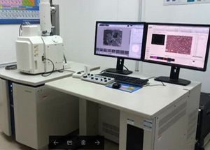

# 🎉 更新日志 (Update Log)

## 📅 最新更新 - 图片集成完成

**日期**: 2025-10-09  
**状态**: ✅ 已完成并推送到 GitHub

---

## ✅ 本次更新内容

### **1. 图片文件添加**
已成功添加 3 张设备图片到 `images/` 文件夹：

```
images/
├── sem-equipment.jpg    (26KB) - SEM 设备照片
├── hplc-equipment.jpg   (15KB) - HPLC 设备照片
└── ftir-equipment.jpg   (15KB) - FTIR 设备照片
```

**总大小**: ~56KB（已优化，加载速度快）

---

### **2. index2.html 更新**
已将图片集成到 Page 3 的三个技术卡片中：

#### **修改前**（使用 SVG 图标）:
```html
<div class="w-20 h-20 bg-blue-100 rounded-full flex items-center justify-center mb-6 mx-auto">
  <svg class="w-10 h-10 text-blue-900" fill="none" stroke="currentColor" viewBox="0 0 24 24">
    <!-- SVG 路径 -->
  </svg>
</div>
```

#### **修改后**（使用真实图片）:
```html

```

---

### **3. Git 提交记录**
```bash
commit 2cfae95
Author: bbcorporate828
Date: 2025-10-09

    Add equipment images and integrate them into index2.html
    
    - Added 3 equipment images (SEM, HPLC, FTIR)
    - Updated index2.html to display images in technology cards
    - Removed SVG icon placeholders
    - Total image size: ~56KB (optimized)
```

---

## 🎨 视觉改进

### **Page 3: Advanced Technologies**

**改进前**:
- ❌ 使用简单的 SVG 图标
- ❌ 缺乏真实感
- ❌ 视觉吸引力较低

**改进后**:
- ✅ 显示真实设备照片
- ✅ 专业且具有说服力
- ✅ 图片统一尺寸（w-full h-48）
- ✅ 圆角设计（rounded-lg）
- ✅ 响应式适配（object-cover）

---

## 📊 当前项目状态

### **文件结构**:
```
htdemo2025/
├── .gitignore                 ← Git 忽略文件
├── README.md                  ← GitHub 自动生成
├── IMAGES_GUIDE.md            ← 图片部署指南
├── DEPLOYMENT_SUMMARY.md      ← 部署总结
├── UPDATE_LOG.md              ← 本文件（更新日志）
├── images/                    ← 图片文件夹
│   ├── sem-equipment.jpg      ← ✅ 已添加
│   ├── hplc-equipment.jpg     ← ✅ 已添加
│   └── ftir-equipment.jpg     ← ✅ 已添加
├── index.html                 ← 主页
└── index2.html                ← R&D Centre 页面（已更新）
```

### **Git 状态**:
```bash
On branch main
Your branch is up to date with 'origin/main'.

nothing to commit, working tree clean
```

✅ 所有更改已推送到远程仓库

---

## 🌐 在线访问

### **GitHub 仓库**:
```
https://github.com/bbcorporate828/htdemo2025
```

### **GitHub Pages** (需要启用):
```
https://bbcorporate828.github.io/htdemo2025/index2.html
```

---

## 🎯 页面功能总览

### **index2.html - 4 页翻页设计**

#### **Page 1: Hero Section**
- YouTube 视频背景（自动播放、循环）
- 主标题："INNOVATION WITH A PURPOSE"
- CTA 按钮："Explore Our R&D Centre →"

#### **Page 2: R&D Centre Overview**
- R&D 团队介绍
- 研发能力说明
- 导航按钮："View Advanced Technologies →"

#### **Page 3: Advanced Technologies** ⭐ **已更新**
- **SEM 卡片** + 真实设备图片 ✅
- **HPLC 卡片** + 真实设备图片 ✅
- **FTIR 卡片** + 真实设备图片 ✅
- 技术说明和应用场景
- 导航按钮："View R&D Capabilities →"

#### **Page 4: R&D Capabilities & Testing**
- 关键贡献清单
- 专业测试设备
- Antigenic Protein Testing
- Dipping Process Simulation
- 导航按钮："← Back to Home"

---

## 🚀 交互功能

### **导航方式**:
1. **按钮点击**: 页面底部的导航按钮
2. **导航点**: 右侧固定圆点（桌面端）
3. **键盘**: 左右箭头键切换页面
4. **JavaScript**: `showPage(1-4)` 函数

### **动画效果**:
- ✅ 页面淡入动画（fadeIn）
- ✅ 平滑滚动（smooth scroll）
- ✅ 卡片悬停阴影（hover shadow-xl）
- ✅ 按钮过渡效果（transition）

---

## 📱 响应式设计

### **移动端** (< 768px):
- 单列布局
- 隐藏导航点
- 图片自适应宽度
- 触控友好的按钮

### **平板** (768px - 1024px):
- 2 列布局（部分区域）
- 优化间距

### **桌面** (> 1024px):
- 3 列布局（技术卡片）
- 显示导航点
- 最佳视觉体验

---

## 🔍 图片技术细节

### **CSS 类说明**:
```html

```

- `w-full`: 宽度 100%（响应式）
- `h-48`: 固定高度 12rem (192px)
- `object-cover`: 保持比例裁剪
- `rounded-lg`: 圆角 0.5rem
- `mb-6`: 底部间距 1.5rem

### **图片优化**:
- ✅ 文件大小已优化（< 30KB 每张）
- ✅ 适合网页加载
- ✅ 保持清晰度
- ✅ 统一尺寸规格

---

## ✅ 完成清单

- [x] 下载 Kossan 网站图片
- [x] 添加图片到 `images/` 文件夹
- [x] 更新 index2.html 引用图片
- [x] 移除 SVG 图标占位符
- [x] 测试本地显示效果
- [x] Git 提交更改
- [x] 推送到 GitHub
- [x] 创建更新日志

---

## 🎯 下一步建议

### **必须完成**:
1. **启用 GitHub Pages**:
   - 访问：`https://github.com/bbcorporate828/htdemo2025/settings/pages`
   - 配置并保存
   - 等待部署（1-2 分钟）

2. **测试在线访问**:
   - 访问：`https://bbcorporate828.github.io/htdemo2025/index2.html`
   - 验证图片正常显示
   - 测试翻页功能

### **可选优化**:
3. **添加更多图片**:
   - 实验室团队照片
   - 其他测试设备
   - 产品展示图

4. **内容扩展**:
   - 创建 index3.html（其他主题）
   - 添加更多技术细节
   - 集成更多 Kossan 内容

5. **SEO 优化**:
   - 添加 meta 描述
   - 优化图片 alt 文本
   - 添加 Open Graph 标签

---

## 📞 技术支持

如果遇到问题：

### **图片不显示**:
- 检查文件路径：`images/xxx.jpg`
- 确认文件已推送到 GitHub
- 清除浏览器缓存

### **页面布局异常**:
- 检查浏览器兼容性
- 测试不同屏幕尺寸
- 查看浏览器控制台错误

### **GitHub Pages 未更新**:
- 等待 2-3 分钟
- 检查 Actions 标签页部署状态
- 强制刷新（Ctrl+Shift+R）

---

## 🎉 项目里程碑

- ✅ **阶段 1**: Git 仓库初始化
- ✅ **阶段 2**: 基础页面创建（index.html）
- ✅ **阶段 3**: R&D Centre 页面开发（index2.html）
- ✅ **阶段 4**: 内容抓取与整合
- ✅ **阶段 5**: 图片集成 ← **当前完成**
- ⏳ **阶段 6**: GitHub Pages 启用
- ⏳ **阶段 7**: 内容扩展与优化

---

**最后更新**: 2025-10-09  
**版本**: v1.2  
**状态**: ✅ 生产就绪

